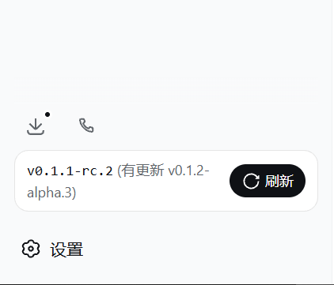
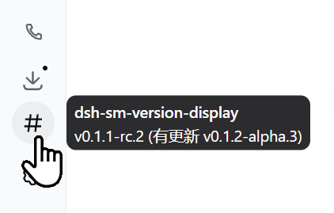
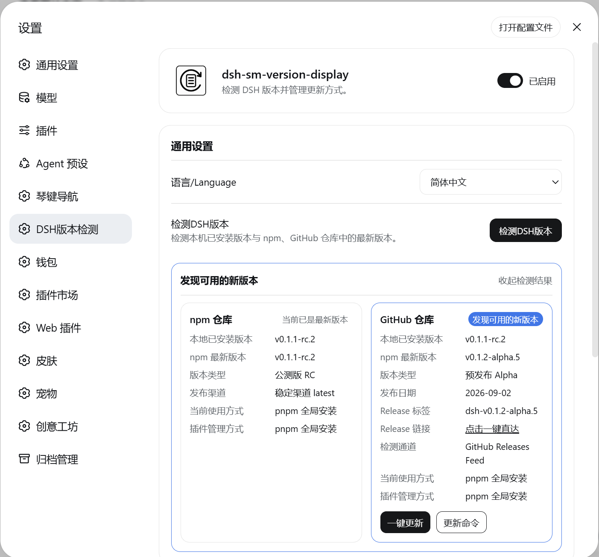
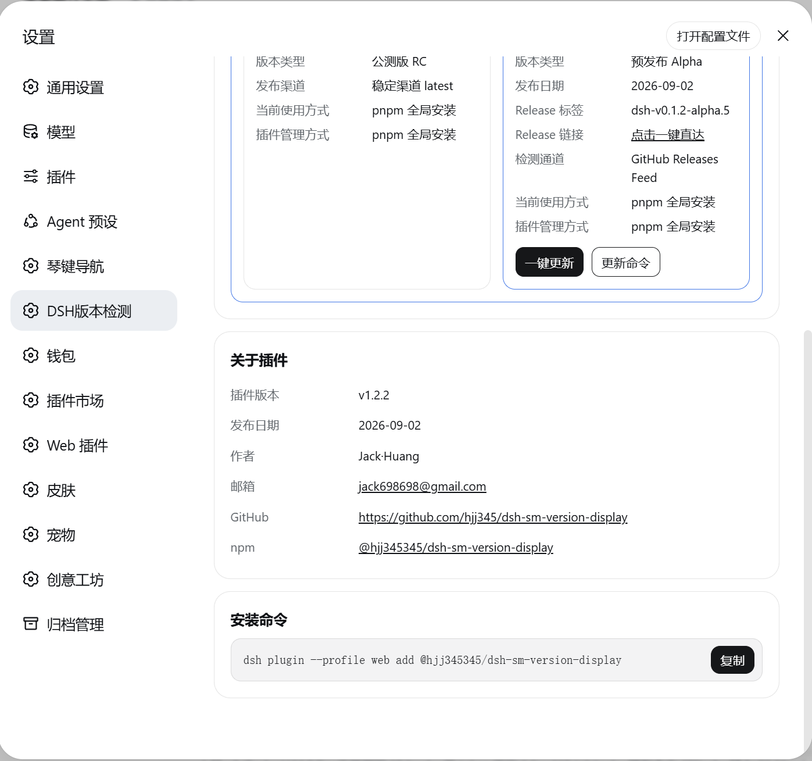
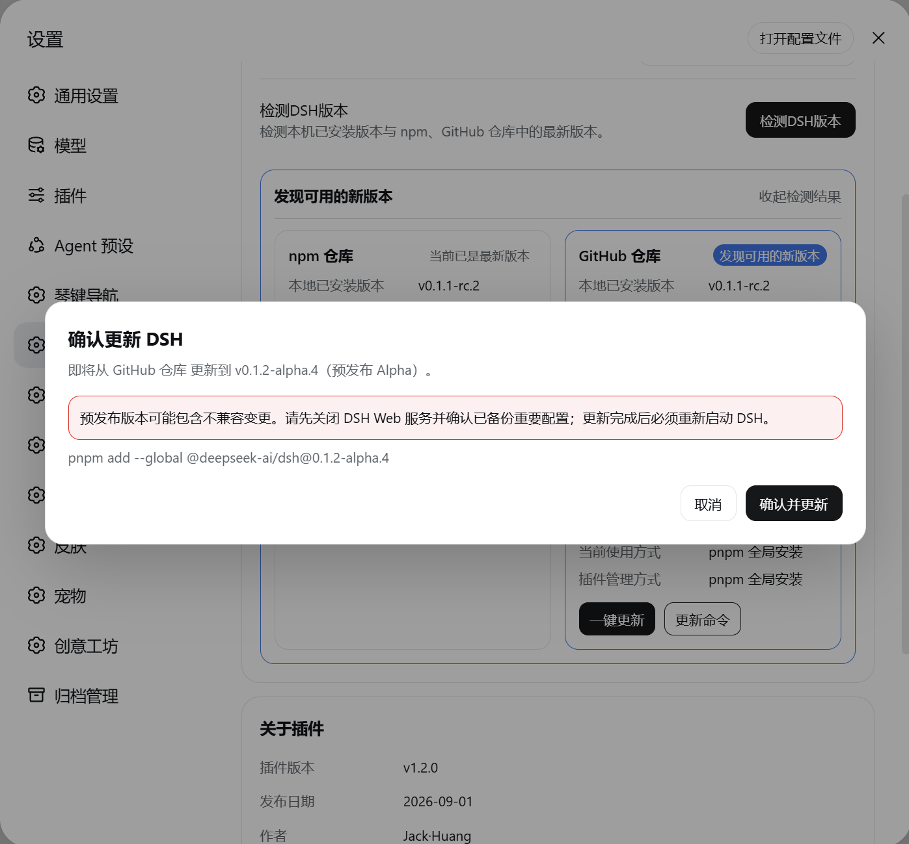
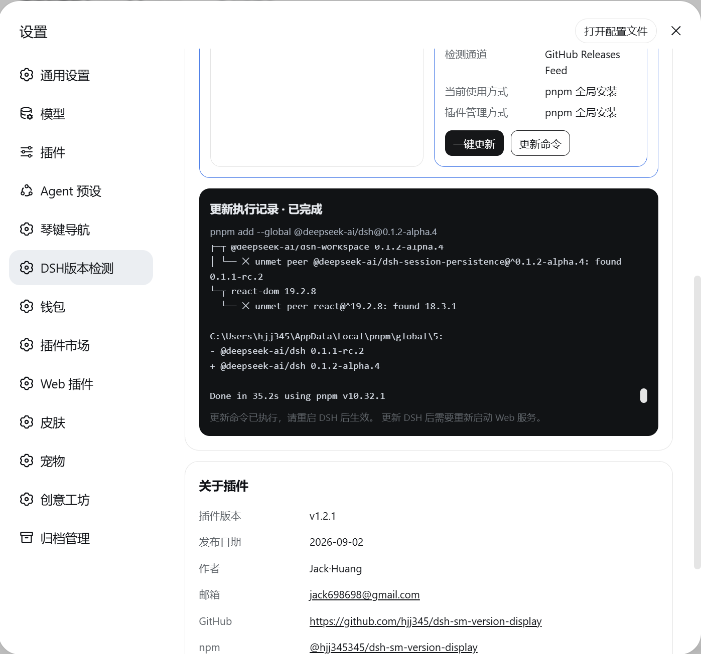

# DSH Version Checker | dsh-sm-version-display

[中文文档](README.md) · English documentation

[](https://www.npmjs.com/package/%40hjj345345%2Fdsh-sm-version-display) [](#compatibility) [](https://nodejs.org/) [](LICENSE) [](#compatibility)

GitHub: [hjj345/dsh-sm-version-display](https://github.com/hjj345/dsh-sm-version-display)<br>
npm: [@hjj345345/dsh-sm-version-display](https://www.npmjs.com/package/%40hjj345345%2Fdsh-sm-version-display)

<p align="center">
  
</p>

> Minimum supported DSH version: `v0.1.2-rc.1` (inclusive). Current plugin version: `v1.2.12`.

## Introduction

`@hjj345345/dsh-sm-version-display` is a client + host dual-half plugin for the DeepSeek Harness (DSH) Web interface. It displays the currently installed DSH version above the sidebar Settings button and checks npm and the official GitHub releases for newer DSH versions.

Since `v1.1.0`, the plugin also adds a first-level **DSH Version Checker** page in DSH Settings (`order: 22`, directly below the reference plugin). The page follows the reference plugin’s card-based design and includes the plugin switch, General settings, About, and Install Command sections. It supports Simplified Chinese, English, and Traditional Chinese. Results are cached for the DSH process and remain available when the settings dialog is reopened. When an update is found, the user can confirm a host-side exact-version update or open the complete manual steps.

The following names refer to different things:

- npm package: `@hjj345345/dsh-sm-version-display`
- DSH runtime plugin ID: `dsh-sm-version-display`
- GitHub repository: `hjj345/dsh-sm-version-display`

Plugin version `v1.2.12` identifies this plugin. The version shown in the card is the DSH version read at runtime; they are not the same version.

## Features

- **Version card**: displays a rounded version card on its own row above the sidebar Settings button.
- **Runtime detection**: the host half reads the installed `@deepseek-ai/dsh` version while rendering the page, so the card follows DSH upgrades after restart.
- **Safe fallback**: if the host version is temporarily unavailable, the card shows “Version unavailable” instead of guessing a fixed version.
- **Update checks**: checks npm and GitHub releases on page load, every 30 minutes, and when the window returns to the foreground; results are cached in the DSH process.
- **GitHub rate-limit fallback**: falls back to the official Releases Atom Feed when the GitHub API is rate-limited, without affecting npm checks.
- **Release types**: classifies GitHub versions as Alpha preview, Beta, Release Candidate, or Release.
- **Semantic comparison**: includes a lightweight comparator for Alpha, Beta, RC, stable, and multi-digit versions.
- **Manual refresh**: provides a refresh button with a loading state and a native-style DSH Toast after the check completes.
- **DSH settings page**: registers “DSH Version Checker” below the reference plugin `sm-context-piano` (`order: 21`), at `order: 22`, using DSH’s default gear icon.
- **Reference-style cards**: includes the plugin hero, enable switch, General settings, About, and Install Command cards.
- **Three language choices**: Simplified Chinese, English, and Traditional Chinese, with Simplified Chinese as the default and persisted in DSH Settings.
- **Expandable check results**: shows side-by-side npm and GitHub cards with versions, release types, dates, links, current installation method, and plugin manager beneath the check button.
- **Two update paths**: requires risk confirmation, then either runs the host-side update or opens complete commands and steps for manual execution.
- **Update output**: automatic updates show the command, live output, completion state, and restart reminder.
- **Backup choice**: updates default to creating a backup, with an explicit skip option that disables backup rollback for that update. Choose a directory on the DSH host and reuse the last location.
- **Backup management**: list complete, failed, and interrupted backups in the default and registered custom directories, including summed file sizes. Refresh, scan a chosen directory, and confirm selected deletions without following links into external files.
- **Failure recovery**: failed backups show the stop time, cause, and copied size, with a fresh-backup retry. Rollback requires a complete, validated backup belonging to the update.
- **Loopback-only update**: only fixed exact-version commands run on the host; GitHub source-only releases fall back to manual build steps.
- **Responsive layout**: shows a round version icon in the collapsed sidebar rail and wraps text when space is limited.
- **Theme aware**: uses DSH design-system variables and follows light and dark themes.
- **Hover tooltip**: the card and collapsed-rail icon show the English plugin name `dsh-sm-version-display` and the current version.

## Screenshots / 实际效果截图

The directory picker browses the **DSH host**, not the remote browser's device. The list does not scan the entire computer; incomplete legacy backups in the default directory are included, and custom locations can be added by scanning a chosen directory. Sizes sum regular-file logical lengths, excluding link targets, and may differ from allocated disk space. Deletion is permanent; deleting the current job's complete backup removes its rollback capability. Backups in use cannot be deleted.

Sidebar version card:

<p align="center">
  
</p>

Collapsed sidebar hover tooltip:

<p align="center">
  
</p>

Settings page overview:

<p align="center">
  
</p>

Dual-source version check results:

<p align="center">
  
</p>

Update confirmation dialog:

<p align="center">
  
</p>

Update execution record, About section, and install command:

<p align="center">
  
</p>

Example states:

```text
vX.Y.Z (Latest)
vX.Y.Z (Update available: vA.B.C)
```

## Installation and removal

### Install from npm (recommended)

Run this on the machine where DSH is installed:

```powershell
dsh plugin --profile web add @hjj345345/dsh-sm-version-display
```

Restart the DSH Web service or reopen the Web interface after installation:

```powershell
dsh web
```

To remove the plugin:

```powershell
dsh plugin --profile web remove @hjj345345/dsh-sm-version-display
```

### Link a local development directory

For local development, use `link:` with the plugin directory. The path below is only an example; replace it with your actual path and never commit a personal machine path to the README, source, or npm package:

```powershell
dsh plugin --profile web add link:C:/path/to/dsh-sm-version-display
```

Use local linking only for development. Switch back to the npm package for normal use.

## Settings page and DSH updates

Open DSH Settings and select **DSH Version Checker**. Click **Check DSH version** to expand the npm and GitHub results directly below the button. Results remain cached for the DSH process; clicking **Collapse result** keeps them collapsed until DSH is restarted.

The command dialog always distinguishes npm and npx. If the host detects a pnpm global installation, it is shown first:

```powershell
# npm global install
npm install --global @deepseek-ai/dsh@<version>

# npx temporary execution
npx --yes @deepseek-ai/dsh@<version> web

# pnpm global install
pnpm add --global @deepseek-ai/dsh@<version>
```

npx has no global installation to replace. If a GitHub Release has no matching npm package, follow the dialog’s clone, checkout, pnpm install, build, and launch steps manually. Restart the DSH Web service after any update.

Automatic updates first show the source, target version, release type, and risks. After confirmation, the plugin backs up and checks the target. If a global or profile dependency is pinned to an older version, it provides an exact command to run after stopping DSH. Restart DSH and verify from the plugin page before the update is marked successful. Alpha, Beta, and RC releases may contain breaking changes. Back up `.dsh` configuration and profile data before switching channels, and use an exact older version such as `@deepseek-ai/dsh@0.1.1-rc.2` to roll back.

## How it works

```text
DSH host process
  lib/index.js
    └─ listens to webserver/index-inject
       reads version from the installed @deepseek-ai/dsh/package.json
       injects globalThis["__DSH_VERSION__"], __DSH_INSTALL_INFO__, and a page token
              │
              ▼
DSH Web browser
  client/client.js
    ├─ registers the sidebar.footer.action card and settings.section page
    ├─ reads window.__DSH_VERSION__ and renders the version card
    ├─ GETs the local check route (host caches npm and GitHub releases)
    └─ POSTs to the loopback-only update route with fixed exact-version arguments
       compares the current version with both sources
```

Key files in the published package:

| File | Purpose |
| --- | --- |
| `lib/index.js` | Host half; injects the current DSH version |
| `client/client.js` | Client half; card, update checks, Toast, and styles |
| `cordis.patch.yml` | Mounts the plugin into the DSH profile layer |
| `LICENSE` | MIT open-source license |

## Privacy and network behavior

- The host half reads only the version field and installation-path type from the locally installed DSH package manifest; absolute paths are not sent to the browser.
- The host half queries npm Registry and GitHub Releases and caches results in process memory; GitHub API rate limits fall back to the official Releases Atom Feed; update requests carry the page-level token injected by the host.
- The update route accepts only loopback requests with the matching token and does not accept arbitrary commands or arguments from the browser.
- The request does not include DSH credentials, conversation content, or user files; the plugin does not read chat content.
- If the registry request fails, the current version remains visible and a generic error is shown for manual checks.
- The repository and npm package exclude `.env`, `.npmrc`, tokens, keys, certificates, logs, dependency directories, and local DSH data.

## Compatibility

| Item | Requirement |
| --- | --- |
| DSH | `>= v0.1.2-rc.1` |
| Verified supported DSH RC builds | `dsh-0.1.5-rc.1`, `dsh-0.1.5-rc.2` |
| Node.js | `>= 20` (host runtime) |
| Platform | DSH Web |
| Plugin version | `v1.2.12` |

The plugin uses official DSH extension points: `dsh.client`, `sidebar.footer.action`, `settings.section`, `webserver/index-inject`, and `ctx.slots.inject/register`. Older DSH versions can persist preferences through `ctx.settingsScope`; versions without it store the enabled state and language in the browser. The update flow checks resolved dependency versions, while third-party plugin compatibility still needs a check after restart.

The plugin market reads the minimum host version from the npm package's top-level `engines.dsh`; this plugin declares `>=0.1.2-rc.1`, matching the table above.

## Development and local verification

This plugin uses the hand-written bundle format used by DSH client plugins: `window.__ModuleLoader__.load({ id, factory })`. It does not require an additional compiler or runtime dependency.

Run these commands from the project root:

```powershell
npm run check
npm run build
```

`npm run build` performs host/client syntax checks, comparator self-tests, settings/update contract checks, package-integrity checks, and README checks.

## Changelog

### v1.2.12 - 2026-09-24

- Added an npm Trusted Publishing workflow for `v*` tag pushes and manual releases from `master`. Before publishing, it verifies that the tag or input version matches `package.json`, then runs the build, tests, and npm publish.
- Fixed cross-platform backup-directory path validation and added the corresponding test coverage. The Trusted Publishing workflow also installs the host peer dependency required by route tests so CI can run the full test suite.
- Fixed timeout and list races during automatic-backup deletion: scheduled refreshes are deferred until deletion completes, preventing stale requests from restoring deleted entries; the catalog is then updated and the result is reported.
- Updated the package, client About page, release contract, and bilingual documentation to plugin version `v1.2.12` with release date `2026-09-24`.

### v1.2.11 - 2026-09-24

- Improved DSH one-click upgrade backup management with default backups, an explicit skip-backup option, a selectable DSH host directory, and reuse of the last selected backup directory; browsing stays on the DSH host, does not scan the remote browser device, and does not follow symbolic links.
- Added and refined the backup-management card: complete, failed, and interrupted backups in the default or custom directory now show file counts and logical sizes, with refresh, directory scan, and confirmed deletion; in-use, incomplete, or path-changed backups are protected.
- Strengthened failure recovery by showing the backup failure reason, stop time, and copied size, with backup retry support; rollback is allowed only for a complete, validated backup matching the current update task, and a recovery copy is retained.
- Refined the update dashboard, backup-directory chooser, and three-language copy, and added backup-manager, route, UI, and release-contract tests covering directory safety, manifests, progress, deletion protection, and recovery paths.
- Updated the package, client About page, and bilingual documentation to plugin version `v1.2.11` with release date `2026-09-24`.

### v1.2.10 - 2026-09-15

- Fixed concurrent update-state writes by giving host and update-worker processes unique temporary files containing their process IDs and random identifiers, preventing shared `.tmp` files from overwriting one another.
- Improved Windows atomic-replace reliability by retrying state-file renames for `EPERM`, `EACCES`, and `EBUSY` a bounded number of times, then cleaning up the temporary file on success or failure.
- Removed the duplicate state write after the Worker starts, preventing the host from overwriting the Worker’s newer upgrade state while recording its PID.
- Extended release-contract checks for host/Worker state-write retry constants, `SharedArrayBuffer` waiting, and rejection of the old shared temporary-file naming pattern.
- Updated the package, client About page, and bilingual documentation to plugin version `v1.2.10` with release date `2026-09-15`.

### v1.2.9 - 2026-09-15

- Improved the DSH upgrade backup-progress and heartbeat dashboard with live backup scan/copy progress, current step, target version, command, and processed-file counts for easier troubleshooting.
- Strengthened Worker heartbeats by recording the last activity time; after 10 minutes without progress the job is marked heartbeat-expired and offers continue waiting, auto repair, or rollback instead of leaving the state ambiguous.
- Improved the repair flow with a Web profile-repair step covering common failures such as profile/config export issues, port conflicts, and a still-running DSH process, with manual repair commands and guidance when needed.
- Improved update-action interaction with an update dashboard, target version, and explicit no-command-output state; wait, auto-repair, and rollback actions now stop or resume the Worker safely during transitions.
- Extended three-language copy and release-contract checks for heartbeat timeouts, progress dashboards, profile repair, update actions, and the upgrade Worker.
- Updated the package, client About page, and bilingual documentation to plugin version `v1.2.9` with release date `2026-09-15`.

### v1.2.8 - 2026-09-14

- Improved the safe DSH one-click upgrade flow with a dedicated update worker that runs backup, target-version preflight, global dependency-tree repair, target installation, and installation/profile verification as separate steps without blocking the main process.
- Added recoverable environment backups for the global DSH directory and DSH profile data, including a manifest with version, paths, file count, and byte count; directory traversal does not follow symbolic links.
- Improved failure handling by persisting worker steps, output, warnings, and state; interrupted jobs are marked failed, and completed backups enable auto repair and one-click rollback, with post-rollback version verification and a retained recovery copy.
- Improved client update interaction with backup path, backup file count, step states, and peer-dependency warnings; failed updates now offer auto repair or one-click rollback and poll the new update-action job state.
- Added `lib/update-worker.mjs` to the npm publish allowlist and expanded Worker self-tests, virtual-store parsing checks, client update-action checks, and published-file contract checks.
- Updated the package, client About page, and bilingual documentation to plugin version `v1.2.8` with release date `2026-09-14`.

### v1.2.7 - 2026-09-07

- Removed the `--virtual-store-dir` argument, which pnpm rejects for global installs.
- When the legacy global virtual-store layout is detected, the plugin first runs `pnpm install --global --force`, then runs the normal DSH update command sequentially.

### v1.2.6 - 2026-09-07

- Fixed failure to read `virtualStoreDir` when PNPM stores `.modules.yaml` as single-line JSON, ensuring one-click updates reuse the existing global virtual-store directory.
- Added self-tests for both JSON and legacy line-oriented metadata formats so the update command cannot silently fall back to the old command without the directory argument.

### v1.2.5 - 2026-09-07

- Fixed PNPM global-update compatibility around the virtual store directory: the plugin now walks upward from the resolved DSH package to read and validate `virtualStoreDir` from `.modules.yaml`, then passes it to the update command when available to avoid dependency-tree location mismatches.
- Improved command-path handling for quoted `.modules.yaml` values, Windows absolute paths, and a bounded search through up to 10 parent directories; arguments containing spaces, `&`, or quotes are safely quoted for Windows `cmd.exe` execution.
- Extended the release-contract checks to cover virtual-store resolution, the `--virtual-store-dir` argument, and the existing client injection contract so the PNPM compatibility fix cannot regress.
- Updated the package, client About page, and bilingual documentation to plugin version `v1.2.5` with release date `2026-09-07`.

### v1.2.4 - 2026-09-03

- Fixed DSH client-module loading compatibility by replacing the obsolete `@deepseek-ai/dsh-client-runtime` entry in `dsh.client.inject` with `@deepseek-ai/dsh-client-modules`, while retaining the locale, settings, slots, and UI-primitives injections.
- Strengthened the release-contract checks to require `@deepseek-ai/dsh-client-modules` and reject any remaining `@deepseek-ai/dsh-client-runtime`, preventing the client loading entry point from regressing.
- Updated the package, client About page, and bilingual documentation to plugin version `v1.2.4` with release date `2026-09-03`.

### v1.2.3 - 2026-09-03

- Added bilingual README screenshots covering the sidebar version card, collapsed-sidebar hover tooltip, settings-page overview, npm/GitHub dual-source check results, update confirmation dialog, and update execution record, About section, and install command.
- Added `images/Screenshot/` to the npm publish allowlist so the package includes all 6 screenshots referenced by the READMEs.
- Synchronized the release-contract checks with the screenshot publish directory and updated the current plugin version and release-date checks to keep documentation, package metadata, and published contents aligned.
- Updated the package, client About page, and bilingual documentation to plugin version `v1.2.3` with release date `2026-09-03`.

### v1.2.2 - 2026-09-02

- Fixed compatibility with newer DSH settings services by removing the direct `settingsNamespace` helper import and registering plugin settings with the namespace string, supporting newer `@deepseek-ai/dsh-settings` releases.
- Extended peer dependency ranges to support `@deepseek-ai/dsh-settings` `0.1.2-alpha.2` and `0.1.2-alpha.4`, plus `@deepseek-ai/schemastery` `3.18.2`, while retaining existing compatible versions.
- Updated the release-contract checks to verify the new string-based namespace registration so the DSH settings compatibility fix cannot regress silently.
- Synchronized the package, client About page, and bilingual documentation to plugin version `v1.2.2` with release date `2026-09-02`.

### v1.2.1 - 2026-09-02

- Fixed GitHub version-check rate-limit handling: failed GitHub API requests now fall back to the Releases Atom Feed, with API and feed results normalized to the same version, type, tag, publication date, release link, and npm-availability fields.
- Improved GitHub check status reporting: API, fallback feed, rate-limited, and temporarily unavailable states are distinguished; the sidebar version card, tooltip, result cards, and update toast now keep npm/GitHub sources and statuses visible.
- Improved Release links: whether data comes from the GitHub API or Atom Feed, links are normalized to the official Release page and expose a localized “Click to open” action.
- Completed the three-language copy for the stable `latest` channel, update sources, check channels, feed status, rate-limit messages, and direct Release links in Simplified Chinese, English, and Traditional Chinese; the language selector consistently remains `语言/Language`.
- Extended the release-contract checks for GitHub feed fallback, rate-limit errors, check channels, feed copy, direct Release links, and all localized keys so the new path remains covered.
- Updated the package, client About page, and bilingual documentation to plugin version `v1.2.1` with release date `2026-09-02`.

### v1.2.0 - 2026-09-01

- Reworked dual-source version checks to query the npm Registry and official GitHub Releases, showing the current and latest versions, release type, publication date, release tag, link, and npm availability.
- Improved version parsing and comparison for Alpha, Beta, RC, stable, and multi-digit versions, with distinct latest, update available, current newer, and check failed states.
- Improved check timing and caching: checks run on page load, refresh every 30 minutes, and refresh after the window returns to the foreground when the interval allows; results are cached in the DSH process to avoid duplicate requests.
- Updated the settings result UI with expandable side-by-side npm and GitHub cards, current installation method and plugin manager details, plus clear Simplified Chinese, English, and Traditional Chinese labels for the stable `latest` channel.
- Added a safer update flow that shows the source, target version, release type, and risks before confirmation; only confirmed fixed-version commands are executed.
- Hardened host-side updates by requiring a loopback address, valid origin, and page-level token, validating stale targets, preventing duplicate jobs, and reporting command output, completion state, failure reasons, and restart reminders.
- Covered multiple update methods: npm and pnpm support host-side one-click updates, npx provides a temporary execution command, and GitHub releases without a matching npm package fall back to clone, checkout, install, build, and launch steps.
- Synchronized the package, About page, and bilingual documentation to plugin version `v1.2.0` with release date `2026-09-01`, and added the corresponding build and localization contract checks.

### v1.1.1 - 2026-08-29

- Added the black-and-white outlined plugin logo to both READMEs and the top of the settings page.
- Kept the reference project's 54px desktop settings-page presentation and embedded the PNG so npm installations remain self-contained.

### v1.1.0 - 2026-08-29

- Added the DSH Version Checker settings section below the reference plugin, with the default gear icon.
- Added the reference-style plugin settings cards and three-language setting.
- Added expandable version results, npm/npx/pnpm distinction, and a loopback-only one-click update route.
- Unified all user-visible plugin version labels to `v1.1.0`.

### v1.0.1 - 2026-08-29

- Fixed the DSH bundle import name for the scoped npm package while preserving the runtime plugin ID.

### v1.0.0 - 2026-08-28

- Initial release of the DSH Web version display plugin.
- Added runtime DSH version detection, npm registry update checks, manual refresh, and Toast feedback.
- Added responsive sidebar layout, light/dark theme support, and bilingual UI.
- Added semantic version comparison, request timeout handling, and a safe fallback when the version is unavailable.

## Author

Author: Jack·Huang<br>
Email: [jack698698@gmail.com](mailto:jack698698@gmail.com)

## License

This project is released under the [MIT License](LICENSE). Copyright © 2026 Jack·Huang.
